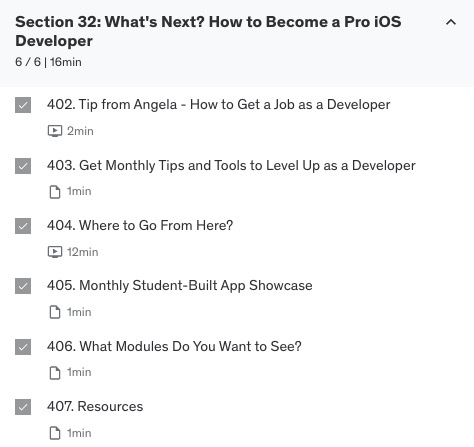
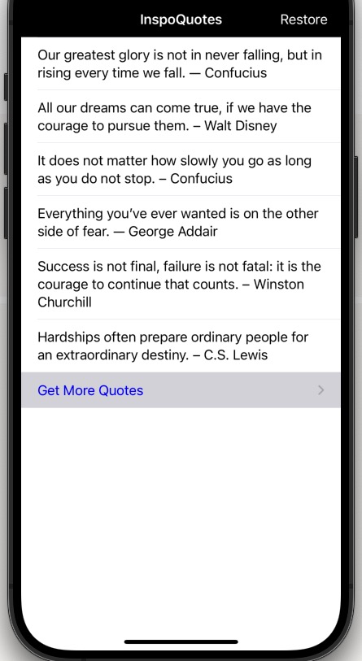

# 100DaysOfCode Challenge

This is my first #100DaysOfCode challenge. I have been challenging myself to code for at least an hour a day for 100 consecutive days from November 22, 2023. This repository is created on its 31st day. 

I am joining the challenge with Swift and iOS App development. I am studying to become a developer and following the course [iOS & Swift - The Complete iOS App Development Bootcamp](https://www.udemy.com/course/ios-13-app-development-bootcamp/) by Angela Yu who is the best instructor ever! 

In this repository, I will log the progress of my coding journey for 100 days. Let's get coding!


### Contents
* [Rules](https://github.com/SoyeongKimm/100DaysOfCodeChallenge?tab=readme-ov-file#rules)
* [Study Plan & Do](https://github.com/SoyeongKimm/100DaysOfCodeChallenge?tab=readme-ov-file#study-plan--do)
* [Challenge Calendar](https://github.com/SoyeongKimm/100DaysOfCodeChallenge?tab=readme-ov-file#challenge-calendar)
* [Daily Log](https://github.com/SoyeongKimm/100DaysOfCodeChallenge?tab=readme-ov-file#dayily-log)

--------------------------------------------------------------
<br>

## Rules
1. **Make a commitment to myself**: <br>
  I pledge to code for at least an hour a day for 100 days. I am committed to completing the course. I wll keep myself on track, even though some days I might feel tired and frustrated. I will keep myself accountable. I wll make this a priority during my day. I will overcome difficulties and achieve my goal. (Reference from [100 Days of Python](https://kmooc.udemy.com/course/100-days-of-code/))
2. **Log my progress every day**: <br>
  I will push commits to this repository daily. 

<br>

## Study Plan & Do
Link to [Course Study Plan-Do Sheets](https://docs.google.com/spreadsheets/d/1ZdgHI7o52geekRd0zQQbenZRAjpSLaNTBQVupDP0t88/edit#gid=89486382)

<br>

## Challenge Calendar
A click on any day leads me straight to its corresponding daily log.
<table>
<tr><th>100 Days Of Code</th><th>Monthly Calendar</th></tr>
<tr><td>

|Wk.|M|T|W|T|F|S|S|
|:---:|:---:|:---:|:---:|:---:|:---:|:---:|:---:|
|**#47**| | |1|2|3|4|5|
|**#48**|6|7|8|9|10|11|12|
|**#49**|13|14|15|16|17|18|19|
|**#50**|20|21|22|23|24|25|26|
|**#51**|27|28|29|30|[31](https://github.com/SoyeongKimm/100DaysOfCodeChallenge?tab=readme-ov-file#day-31-dec-22-2023)|[32](https://github.com/SoyeongKimm/100DaysOfCodeChallenge?tab=readme-ov-file#day-32-dec-23-2023)|[33](https://github.com/SoyeongKimm/100DaysOfCodeChallenge?tab=readme-ov-file#day-33-dec-24-2023)|
|**#52**|[34](https://github.com/SoyeongKimm/100DaysOfCodeChallenge?tab=readme-ov-file#day-34-dec-25-2023)|[35](https://github.com/SoyeongKimm/100DaysOfCodeChallenge?tab=readme-ov-file#day-35-dec-26-2023)|[36](https://github.com/SoyeongKimm/100DaysOfCodeChallenge?tab=readme-ov-file#day-36-dec-27-2023)|[37](https://github.com/SoyeongKimm/100DaysOfCodeChallenge?tab=readme-ov-file#day-37-dec-28-2023)|[38](https://github.com/SoyeongKimm/100DaysOfCodeChallenge?tab=readme-ov-file#day-38-dec-29-2023)|[39](https://github.com/SoyeongKimm/100DaysOfCodeChallenge?tab=readme-ov-file#day-39-dec-30-2023)|[40](https://github.com/SoyeongKimm/100DaysOfCodeChallenge?tab=readme-ov-file#day-40-dec-31-2023)|
|**#01**|[41](https://github.com/SoyeongKimm/100DaysOfCodeChallenge?tab=readme-ov-file#day-41-1-jan-2024)|[42](https://github.com/SoyeongKimm/100DaysOfCodeChallenge?tab=readme-ov-file#day-42-2-jan-2024)|[43](https://github.com/SoyeongKimm/100DaysOfCodeChallenge?tab=readme-ov-file#day-43-3-jan-2024)|[44](https://github.com/SoyeongKimm/100DaysOfCodeChallenge?tab=readme-ov-file#day-44-4-jan-2024)|[45](https://github.com/SoyeongKimm/100DaysOfCodeChallenge?tab=readme-ov-file#day-45-5-jan-2024)|[46](https://github.com/SoyeongKimm/100DaysOfCodeChallenge?tab=readme-ov-file#day-46-6-jan-2024)|[47](https://github.com/SoyeongKimm/100DaysOfCodeChallenge?tab=readme-ov-file#day-47-7-jan-2024)|
|**#02**|[48](https://github.com/SoyeongKimm/100DaysOfCodeChallenge?tab=readme-ov-file#day-48-8-jan-2024)|[49](https://github.com/SoyeongKimm/100DaysOfCodeChallenge?tab=readme-ov-file#day-49-9-jan-2024)|[50](https://github.com/SoyeongKimm/100DaysOfCodeChallenge?tab=readme-ov-file#day-50-10-jan-2024)|[51](https://github.com/SoyeongKimm/100DaysOfCodeChallenge?tab=readme-ov-file#day-51-11-jan-2024)|[52](https://github.com/SoyeongKimm/100DaysOfCodeChallenge?tab=readme-ov-file#day-52-12-jan-2024)|[53](https://github.com/SoyeongKimm/100DaysOfCodeChallenge?tab=readme-ov-file#day-53-13-jan-2024)|[54](https://github.com/SoyeongKimm/100DaysOfCodeChallenge?tab=readme-ov-file#day-54-14-jan-2024)|
|**#03**|[55](https://github.com/SoyeongKimm/100DaysOfCodeChallenge?tab=readme-ov-file#day-55-15-jan-2024)|[56](https://github.com/SoyeongKimm/100DaysOfCodeChallenge?tab=readme-ov-file#day-56-16-jan-2024)|[57](https://github.com/SoyeongKimm/100DaysOfCodeChallenge?tab=readme-ov-file#day-57-17-jan-2024)|[58](https://github.com/SoyeongKimm/100DaysOfCodeChallenge?tab=readme-ov-file#day-58-18-jan-2024)|[59](https://github.com/SoyeongKimm/100DaysOfCodeChallenge?tab=readme-ov-file#day-59-19-jan-2024)|    60|    61|
|**#04**|62|    63|    64|    65|    66|    67|    68|
|**#05**|69|    70|    71|    72|    73|    74|    75|
|**#06**|76|    77|    78|    79|    80|    81|    82|
|**#07**|83|    84|    85|    86|    87|    88|    89|
|**#08**|90|    91|    92|    93|    94|    95|    96|
|**#09**|97|    98|    99|    100|  |  |  |

</td><td>

|Mo.|M|T|W|T|F|S|S|
|:---:|:---:|:---:|:---:|:---:|:---:|:---:|:---:|
|**Nov**| | |22|23|24|25|26|                
|   |27|28|29|30|1|2|3|
|**Dec**|4|5|6|7|8|9|10|
| |11|    12|    13|    14|    15|    16|    17|
| |18|    19|    20|    21|    22|    23|    24|
| |25|    26|    27|    28|    29|    30|    31|
|**Jan**|1|    2|    3|    4|    5|    6|    7|
| |8|    9|    10|    11|    12|    13|    14|
| |15|    16|    17|    18|    19|    20|    21|
| |22|    23|    24|    25|    26|    27|    28|
| |29|    30|    31|    1|    2|    3|    4|
|**Feb**|5|    6|    7|    8|    9|    10|    11|
| |12|    13|    14|    15|    16|    17|    18|
| |19|    20|    21|    22|    23|    24|    25|
| |26|    27|    28|    29|

</td></tr> </table>

<br>

## Daily Log 

### Day 59 (19 Jan, 2024)
- Lecture 429 - 439, User Experience Design, Section 33 The Complete App Design
   - How can you make user experience as pain free and even as enjoyable as possible? Getting the UX right is the key for users to keep my app on their phones among hundreds of similar types of the app.
   - The things we should keep in mind when designing the app
      - Usability(Core functionality), Consistent design, Light pattern, Simplicity, Intuitiveness, No anti-pattern

<br>

### Day 58 (18 Jan, 2024)
- Started to read the book, "[Deep Work](https://www.amazon.com/Deep-Work-Focused-Success-Distracted/dp/1455586692)" by Cal Newport, recommended by Angela Yu
- Read the articles about the user interface also recommended by her
   - Golden Rules of User Interface Design <br> https://uxplanet.org/golden-rules-of-user-interface-design-19282aeb06b#.kfznrp77q
   - Designing User Interfaces for My Mother <br> https://medium.com/@TGines/designing-user-interfaces-for-your-mother-dd45ec50f7b0#.j4bcs8rto

<br>

### Day 57 (17 Jan, 2024)
- Lecture 421 - 428, User Interface Design, Section 33 The Complete App Design
   - We should be a tour guide that takes the user on a wonderful journey through the app.
   - The app should be guided, curated and a visual journey for users to go on.
   - Function comes before form.
   - Design is meant to give the user conscious and subconscious clues as to how you should be able to interact with the digital world.
   - Start with the design that is completely monochrome just black and white or hints of gray and Give it a single shot of color to highlight the key things that you want to draw user's attention to.
   - The reason why we want to learn about design in order to better understand, translate and mimic the idea of clients.

<br>

### Day 56 (16 Jan, 2024)
- Started my project "My Word Book" which will be a personal dictionary app and added it to this 100DaysOfCodeChallenge repository
- Created a tableView with a navigation bar and a right bar button
- Added an UIAlert with two text fields and two action buttons
- Error I met today <br>
   `Text fields can only be added to an alert controller of style UIAlertControllerStyleAlert` which means the text fields cannot be added to the actionSheet but to the alert only.


<br>

### Day 55 (15 Jan, 2024)
- Lecture 415 - 420, Section 33 The Complete App Design
   - Learned about typography(serif, san serif of the different time era)
   - Learned I should not use fancy fonts which I often used in my previous projects

<br>

### Day 54 (14 Jan, 2024)
- Lecture 408 - 414, Section 33 The Complete App Design
   - Learned the colour theory and how to combine colours (analogous, complementary, split, triadic, monochromatic colours)
   - Used the recommended tools for color palettes

<br>

### Day 53 (13 Jan, 2024)
- Lecture 289, Section 20. In-App Purchases and Apple StoreKit
   - Learned how to implement the in-app purchase restoration process
   - Reference: [Restoring purchased products](https://developer.apple.com/documentation/storekit/in-app_purchase/original_api_for_in-app_purchase/restoring_purchased_products)

<br>

### Day 52 (12 Jan, 2024)
- Lecture 286 - 288, Section 20. In-App Purchases and Apple StoreKit
   - Implemented the in-app purchase process in [InspoQuotes](https://github.com/SoyeongKimm/100DaysOfCodeChallenge/blob/main/InspoQuotes/InspoQuotes/QuoteTableViewController.swift)
   - Added the code and comments in the code block of Day 51 

<br>

### Day 51 (11 Jan, 2024)
- Lecture 402 - 407, Section 32. What's Next?
How to Become a Pro iOS Developer
   - Build a minimum viable product! Make a skateboard!
      

- Lecture 285, Section 20. In-App Purchases and Apple StoreKit

   ```swift
   import UIKit
   //1. Import StoreKit
   import StoreKit

   //5-1. To process a payment, implement SKPaymentTransactionObserver protocol
   class MyTableViewController: UITableViewController, SKPaymentTransactionObserver {

   //2. Create a constant to record the productID
      let productID = "com.YourName.AppName.ProductID"

      override func viewDidLoad() {
         super.viewDidLoad()

   //5-3. Declare the current class as a delegate
         SKPaymentQueue.default().add(self)
      }


   //0. Be called when user clicks the "Buy" button
      func makeAnInAppPurchase() {
   //3. Check whether the user can purchase
         if SKPaymentQueue.canMakePayments() {
   //4. Make a payment request
            let paymentRequest = SKMutablePayment()
               paymentRequest.productIdentifier = productID
               SKPaymentQueue.default().add(paymentRequest)
         } else {
               print("User can't make payments")
         }
      }


   //5-2. Add the delegate method of SKPaymentTransactionObserver protocol
      func paymentQueue(_ queue: SKPaymentQueue, updatedTransactions transactions: [SKPaymentTransaction]) {

   //5-4. Loop through the array of SKPaymentTransaction     
         for transaction in transactions {
   //5-5. Check the transaction's state
               if transaction.transactionState == .purchased {
                  //User payment successful
                  print("Transaction successful!")
   //5-6. End the transaction when success               
                  SKPaymentQueue.default().finishTransaction(transaction)
               } else if transaction.transactionState == .failed {
                  // User payment failed(cancelled)
                  //print("Transaction failed")
   //5-7. Get the accurate description of the error
               if let error = transaction.error {
                    let errorDescription = error.localizedDescription
                    print("Transaction failed due to error: \(errorDescription)")
                }
   //5-6. End the transaction when success
                  SKPaymentQueue.default().finishTransaction(transaction)
               }
         }
      }
   }
   ```

**Reference** <br>
Framework [`StoreKit`](https://developer.apple.com/documentation/storekit) <br>
Class [`SKPaymentQueue`](https://developer.apple.com/documentation/storekit/skpaymentqueue) <br>
Protocol [`SKPaymentTransactionObserver`](https://developer.apple.com/documentation/storekit/skpaymenttransactionobserver) <br>
Delegate Method [`paymentQueue(_:updatedTransactions:)`](https://developer.apple.com/documentation/storekit/skpaymenttransactionobserver/1506107-paymentqueue)

<br>

### Day 50 (10 Jan, 2024)
- Learned how to add an image in my README
   1. Create a folder in the local repository 
   2. Move the images into the folder 
   3. Write code where the image should be in README <br>
   Note. In order to maintain the image's aspect ratio, specify only one of either width or height
      ```markdown
      
   
      //For example, 
      
      ``````
   
   4. `git add`, `git commit`, and `git push` 

      [](https://unsplash.com/photos/blue-sea-under-blue-sky-and-white-clouds-during-daytime-sGRMspZmfPE)

   Reference:
      [Making A Folder Of Images For Your GitHub Readme](https://medium.com/@gl7526/making-a-folder-of-images-for-your-github-readme-2c6cd42e1439)
   
<br>

- Lecture 283 - 284, Section 20. In-App Purchases and Apple StoreKit 
   - Table view data source and delegate methods
      - Display some text from an array into a table view
      ```swift
      //An array of items
      var array = [one, two, three, four]

      
      //Table View Data Source Methods 1 - Number of the rows
      override func tableView(_ tableView: UITableView, numberOfRowsInSection section: Int) -> Int {
         return array.count 
      }
      
      //Table View Data Source Methods 2 - Configuration of the cell
      override func tableView(_ tableView: UITableView, cellForRowAt indexPath: IndexPath) -> UITableViewCell {
          let cell = tableView.dequeueReusableCell(withIdentifier: "IdentifierName", for: indexPath)
          cell.textLabel?.text = array[indexPath.row]
          return cell
      ```
        
      
      - Detect user interactions
      ```swift
      //Table View Delegate Method - What happens user clicks the cell
      override func tableView(_ tableView: UITableView, didSelectRowAt indexPath: IndexPath) {
         //Print the text of the selected cell
         print(array[indexPath.row])
      }
      ```
   - Location of the "Buy" button(clickable cell, link, or anything)
      - Should be placed where it makes sence and easy to be found
      - In this module, in order to view more quotes user should make a purchase. <br> 
      -> The button is located right below the last free quote. <br>
      -> Make a new UIButton(X) Make one additional cell at the bottom of the table and use it as the big purchasing button(O)

         
   
<br> 

### Day 49 (9 Jan, 2024)
- Permission error during Jekyll installation
   - `sudo` command is not recommended due to the security issue 
   https://stackoverflow.com/questions/17550903/why-do-i-get-a-permission-denied-error-while-installing-a-gem
   - More blogs in Korean (did not work for me) <br> 
   https://jojoldu.tistory.com/288 <br>
   https://iyk2h.tistory.com/159
- Lectures 279 - 282 in Section 20, In-App Purchases and Apple StoreKit 
   - Only virtual products can be sold. Apple charges 30% of my earnings.
   - 80/20 principle: 80% free, 20% charging for premium features or ad removing (Recommended app for reference: [Overcast](https://apps.apple.com/us/app/overcast/id888422857))

<br>

### Day 48 (8 Jan, 2024)
- Met an error during the process of installing Jekyll and searched for the solution
   ```
   ERROR:  While executing gem ... (Errno::EACCES)
       Permission denied @ dir_s_mkdir - /Users/...
   ```
- Chose one theme [Jekyll Decent](https://github.com/jwillmer/jekyllDecent)

<br>

### Day 47 (7 Jan, 2024)
- Had some time for self-reflection about my daily study plan-do
- Set the next week's study plan
- Read a book about computer science and coding for kids which always helps me a lot understand some new concepts 

<br>

### Day 46 (6 Jan, 2024)
- Reread the job requirements for the position I want
- Revised my study plan
- Read a book about Git & GitHub and added new shortcuts and commands to the list

<br>

### Day 45 (5 Jan, 2024)
- Watched Section 31 "How to submit your app to the App Store"
- Revised the local data persistance
- Planned for the project using Realm 
- Decided to leave the Todoey project and come back when I find the solution for the navigation bar

<br>

### Day 44 (4 Jan, 2024)
- Revised the part of updating UI
- Searched and applied the solutions for the error
- Created a new repository for my GitHub blog

<br>

### Day 43 (3 Jan, 2024)
- Revised Todoey previous lectures
- Worked on fixing errors with the navigation bar
- Learned how to make a [GitHub page](https://pages.github.com/)

<br>

### Day 42 (2 Jan, 2024)
- Succeeded to integrate [Chameleon](https://github.com/drasticactions/chameleon) into the project<br>
   - Installed using Swift Package Manager
   - `https://github.com/drasticactions/Chameleon.git`
   - Set the import statement as `import ChameleonSwift`
- Found some errors about the navigation bar and had worked on them

<br>

### Day 41 (1 Jan, 2024)
- Watched lectures and write code for gradient flow cells
- Was still working on Chameleon integration (it was making me want coffee)

<br>

### Day 40 (Dec 31, 2023)
- Worked on integrating Chameleon using SPM and CocoaPods
- Reference <br>
https://kmooc.udemy.com/course/ios-13-app-development-bootcamp/learn/lecture/10929540#questions/20505240 <br>
https://kmooc.udemy.com/course/ios-13-app-development-bootcamp/learn/lecture/10929540#questions/12978282

<br>

### Day 39 (Dec 30, 2023)
- Tried to install Chameleon by Swift Package Manager not CocoaPods but failed
- Searched and demonstrated a few solutions from StackOverflow and Udemy

<br>

### Day 38 (Dec 29, 2023)
- Completed the challenge to subClass the superClass
- Revised the class inheritance and extension
- Learned a new third party library [Chameleon](https://github.com/vicc/chameleon) to integrate for colouring the cells
- Added comments #29 to #33 for superClassing and subClassing

<br>

### Day 37 (Dec 28, 2023)
- Learned how to make the code DRY(Don't Repeat Yourself)
- Made a superClass with duplicated codes so that the existing ViewControllers can inherit from
- Added comments #13 to #28 for superClassing and subClassing

<br>

### Day 36 (Dec 27, 2023)
- Implemented swipable cells thanks to [SwipeCellKit](https://github.com/SwipeCellKit/SwipeCellKit)
- Added comments #1 to #12 about the steps to make cells swipable

<br>

### Day 35 (Dec 26, 2023)
- Reinstalled [SwipeCellKit](https://github.com/SwipeCellKit/SwipeCellKit?tab=readme-ov-file#swift-package-manager) by using Swift Package Manager
- Created a new remote repository and move the folders and files to it
- Downloaded and used [Visual Studio Code](https://code.visualstudio.com/docs/setup/mac) to edit the README file

<br>

### Day 34 (Dec 25, 2023) 
- Removed Realm from the project installed by using CocoaPods
- Installed [Realm](https://www.mongodb.com/docs/realm/sdk/swift/install/#installation) again by using Swift Package Manager

<br>

### Day 33 (Dec 24, 2023) 
**Implement the functionality of cell deletion by using a third party library** <br>
1. Go to [CocoaPods](https://cocoapods.org/) > Search "swipe" > Select "[SwipeCellKit](https://cocoapods.org/pods/SwipeCellKit)" <br>
or Go to [SwipeCellKit](https://github.com/SwipeCellKit/SwipeCellKit) on GitHub
2. [Install](https://github.com/SwipeCellKit/SwipeCellKit/blob/develop/README.md#installation)

&nbsp;&nbsp;&nbsp;&nbsp;&nbsp;&nbsp; In Terminal,
  ```
  $ pod init
  $ open Podfile -a Xcode
  ```
&nbsp;&nbsp;&nbsp;&nbsp;&nbsp;&nbsp; In Podfile,
```
$ pod 'SwipeCellKit'
```
&nbsp;&nbsp;&nbsp;&nbsp;&nbsp;&nbsp; Back in Terminal,
```
$ pod install
```
3. Add `import SwipeCellKit`
4. Set the `delegate` property on `SwipeTableViewCell`
   ```swift
   override func tableView(_ tableView: UITableView, cellForRowAt indexPath: IndexPath) -> UITableViewCell {
    let cell = tableView.dequeueReusableCell(withIdentifier: "Cell") as! SwipeTableViewCell
    cell.delegate = self
    return cell
   }
   ```
5. Adopt the `SwipeTableViewCellDelegate` protocol -> Create an extension to modularise and split up the functionality
   ```swift
   extension ViewController: SwipeTableViewCellDelegate {
   }
   ```
6. Add the delegate methods
   ```swift
   func tableView(_ tableView: UITableView, editActionsForRowAt indexPath: IndexPath, for orientation: SwipeActionsOrientation) -> [SwipeAction]? {
    guard orientation == .right else { return nil }
     //orientation of the swipe is from the right

    let deleteAction = SwipeAction(style: .destructive, title: "Delete") { action, indexPath in
     // "title" means the text underneath the icon
     // inside this closure, handle action by updating model with deletion
    }

    deleteAction.image = UIImage(named: "delete")
     // customise the action appearance
   
    return [deleteAction]
   }
   ```
7. Find the image of "delete(trash)" and Drag it into my Assets.xcassets folder <br>
   SwipeCellKit > Example > MailExample > Assets.xcassets > Trash.imageset > [Trash Icon.png](https://github.com/SwipeCellKit/SwipeCellKit/blob/develop/Example/MailExample/Assets.xcassets/Trash.imageset/Trash%20Icon.png) <br>
   *Note: Rename the image with no space in-bewteen the two words. Place the image in 2x position*
8. Add action
   ```swift
   func tableView(_ tableView: UITableView, editActionsForRowAt indexPath: IndexPath, for orientation: SwipeActionsOrientation) -> [SwipeAction]? {
    guard orientation == .right else { return nil }
   
    let deleteAction = SwipeAction(style: .destructive, title: "Delete") { action, indexPath in
     // handle action by updating model with deletion
     print("Deleted")
    }

    deleteAction.image = UIImage(named: "delete")
     // match the name with the image name

    return [deleteAction]
   }
   ```

<br>

### Day 32 (Dec 23, 2023) 
Swipeable `UITableViewCell` <br>
[SwipeCellKit](https://github.com/SwipeCellKit/SwipeCellKit)

Markdown Syntax <br>
[Basic writing and formatting syntax](https://docs.github.com/en/get-started/writing-on-github/getting-started-with-writing-and-formatting-on-github/basic-writing-and-formatting-syntax)

<br>

### Day 31 (Dec 22, 2023) 
Framework 
- dynamic framework
- static framework 

How to install Realm using CocoaPods
1. `$ pod repo update`
2. `$ pod init`
3. `$ open Podfile -a Xcode`
4. In Podfile, make sure `use_frameworks!` is not commented out. And add `pod 'RealmSwift', '~>10'`
5. `$ pod install`

How to remove CocoaPods and all traces from project 
1. `$ pod deintegrate`
2. `$ pod cache clean --all`
3. Delete 1) Podfile, 2) Podfile.lock, 3) ProjectName.xcworkspace

Resources <br>
[MongoDB Documentation](https://www.mongodb.com/docs/realm/sdk/swift/install/#installation)

---
